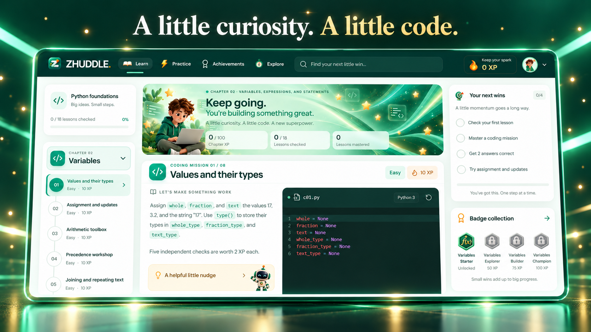
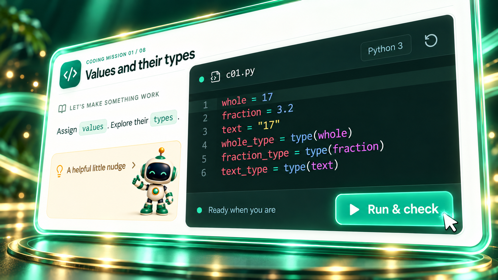

<p align="center">
  <a href="https://zhuddle.com/">
    
  </a>
</p>

<h1 align="center">Your next little win starts with Python.</h1>

<p align="center">
  Learn a concept. Write real code. See what clicks.<br>
  ZHUDDLE turns Python foundations into small, guided missions you can complete in your browser.
</p>

<p align="center">
  <a href="https://zhuddle.com/"><strong>Start learning ↗</strong></a>
  &nbsp; · &nbsp;
  <a href="#see-zhuddle-in-action">Watch the intro</a>
  &nbsp; · &nbsp;
  <a href="#run-it-locally">Run it locally</a>
  &nbsp; · &nbsp;
  <a href="https://github.com/PCTEJA/zhuddle-python/issues">Share feedback</a>
</p>

<p align="center">
  
  
  
  
</p>

---

## A little curiosity. A little code.

Getting started is easier when the next step is clear. ZHUDDLE brings the lesson, code editor, feedback, and progress into one welcoming workspace, so you can focus on making something work.

<a href="https://zhuddle.com/">
  
</a>

<p align="center"><sub>Promotional artwork from the ZHUDDLE intro. <a href="https://zhuddle.com/">Explore the live app →</a></sub></p>

| Make something work | Build a little momentum | Keep what you learn |
| :--- | :--- | :--- |
| Write and run **real Python** in the browser, with a focused mission and helpful hints. | Get feedback from **five checks per coding mission**, retry freely, and earn chapter XP. | Return to saved progress on the same browser and export **notebooks, reports, and completion certificates**. |

## From “I think I get it” to “I made it work.”

1. **Pick a chapter.** Start with Variables or jump to the topic you want to practice.
2. **Try a mission.** Read the prompt, explore a hint, and write your solution in the Python editor.
3. **Run & check.** See the results, improve your answer, and check it again. Retries have no scoring penalty.
4. **Take your progress with you.** Finish the knowledge checks and download your chapter work.

<p align="center">
  <a href="https://zhuddle.com/?chapter=variables">
    
  </a>
</p>

Each chapter has **8 coding missions + 10 knowledge checks = 100 possible XP**. Check all 18 answers to unlock its completion certificate; a perfect score is not required.

## Seven chapters. Room to grow.

Follow the path or revisit a single topic. Every chapter has its own saved answers, score, and downloads.

| Chapter | Practice | Start here |
| :--- | :--- | :--- |
| **02 · Variables** | Values, types, expressions, and assignments | [Explore variables →](https://zhuddle.com/learn/python-variables/) |
| **03 · Conditionals** | Comparisons, branches, and decisions | [Explore conditionals →](https://zhuddle.com/learn/python-conditionals/) |
| **04 · Functions** | Parameters, return values, and reusable code | [Explore functions →](https://zhuddle.com/learn/python-functions/) |
| **05 · Loops** | Repetition, counters, and running totals | [Explore loops →](https://zhuddle.com/learn/python-loops/) |
| **06 · Strings** | Indexing, slicing, searching, and text methods | [Explore strings →](https://zhuddle.com/learn/python-strings/) |
| **07 · Files** | Reading and processing sample text files | [Explore files →](https://zhuddle.com/learn/python-files/) |
| **08 · Lists** | Collections, traversal, and list operations | [Explore lists →](https://zhuddle.com/learn/python-lists/) |

<sub>Chapter numbers follow the <a href="https://www.py4e.com/book">Python for Everybody</a> textbook. These are the seven chapters currently available.</sub>

## See ZHUDDLE in action

A 10-second introduction to the world of ZHUDDLE.

<!-- VIDEO_LINK: Update both links below together if the intro moves to YouTube. See docs/video.md. -->
<p align="center">
  <a href="docs/media/zhuddle-intro.mp4">
    
  </a>
</p>

<p align="center">
  <a href="docs/media/zhuddle-intro.mp4"><strong>▶ View the 10-second intro · MP4</strong></a><br>
  <sub>Opens the video file on GitHub. Download it if playback is unavailable.</sub>
</p>

## Good to know before you begin

- **No Python installation needed.** Python loads on your first code run, which needs an internet connection.
- **Your progress stays in this browser.** Answers and learner details are stored in localStorage, with no student database or cross-device sync. Clearing site data removes saved progress, so export work you want to keep.
- **A local learner profile.** The current course asks for a name and UNT ID for personalized downloads; these remain on your device.
- **Practice at your pace.** Keyboard navigation, a responsive layout, reduced-motion support, and a persistent motion toggle are built in.
- **Certificates celebrate practice.** Scores are local practice results pending instructor review. Certificates are not official UNT credentials.

## Run it locally

**Requirements:** Node.js **22.12+** and [pnpm](https://pnpm.io/installation).

```sh
git clone https://github.com/PCTEJA/zhuddle-python.git
cd zhuddle-python
pnpm install
pnpm dev
```

Open **http://localhost:4321**. Lessons and Python checks work without API keys. To enable the Groq-powered Code Coach and Zhuddle Guide, copy `.env.example` to `.env`, set the server-only `GROQ_API_KEY`, and restart the dev server. See [AI assistant setup](docs/ai-assistant.md) for hosting and free-tier details.

<details>
<summary><strong>Build, test, and explore the code</strong></summary>

### Common commands

| Command | What it does |
| :--- | :--- |
| `pnpm build` | Build the static site into `dist/` |
| `pnpm preview` | Preview the production build locally |
| `pnpm exec playwright install chromium` | Install the browser used by the test suite |
| `pnpm test` | Run browser tests; Pyodide checks need internet access |
| `pnpm test:grader` | Run local grading checks; requires Python |
| `pnpm curriculum:build` | Regenerate chapter banks and notebooks; requires Python |

### Built with

**Astro · React · Pyodide · CodeMirror · jsPDF · Playwright**

Astro delivers the static page, React powers the learning workspace, and Pyodide runs Python in a dedicated web worker. The editor, interpreter, and PDF tools load when needed.

### Find your way around

| Location | Purpose |
| :--- | :--- |
| [`src/components/`](src/components/) | Learning interface and interactions |
| [`src/data/curriculum.js`](src/data/curriculum.js) | Chapter registry |
| [`src/data/chapter-guides.js`](src/data/chapter-guides.js) | Public chapter guide content |
| [`public/python-worker.js`](public/python-worker.js) | Browser Python execution and grading |
| [`scripts/`](scripts/) | Curriculum and media generation |
| [`tests/`](tests/) | Browser checks, grader tests, and reference solutions |

Netlify and Vercel configurations include `/api/assistant`. Deploy the project with its functions and set `GROQ_API_KEY` in the host's server environment. Uploading only `dist/` provides the lessons and built-in guidance, but cannot connect Groq.

</details>

**Go deeper:** [Developer guide](docs/development.md) · [Performance & SEO notes](design/performance-seo-report.md) · [Video publishing guide](docs/video.md)

## Help the next learner find their spark

Found a confusing prompt or an unexpected result? [Open an issue](https://github.com/PCTEJA/zhuddle-python/issues) with the chapter, mission, and what happened. Ideas for clearer explanations, accessibility improvements, and small fixes are welcome.

If ZHUDDLE helps you, **star the repository**, share [zhuddle.com](https://zhuddle.com/), or [support the project](https://www.buymeacoffee.com/hanr).

### Credits

Learning material is based on Charles R. Severance’s [Python for Everybody](https://www.py4e.com/book), licensed under **CC BY 4.0**. ZHUDDLE adds its own question wording, practice scaffolding, scoring, and interface. See the [chapter sources and adaptation notes](docs/development.md#chapters-and-source-boundaries). This attribution describes the source learning material, not a license for the entire repository.

---

<p align="center">
  <strong>Big ideas. Small steps.</strong><br>
  Your next little win is one mission away.<br><br>
  <a href="https://zhuddle.com/"><strong>Start your Python journey →</strong></a>
</p>
